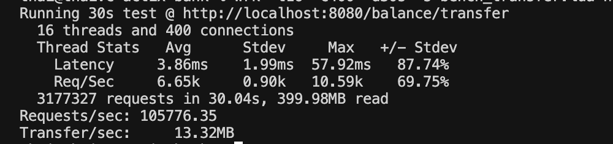
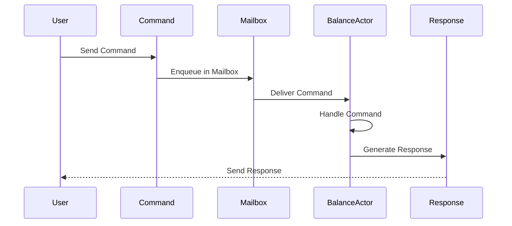

# Bank actor

A high-performance bank account management system built with Rust, leveraging the Actor model for concurrent transaction processing and RocksDB for durable storage.

## Benchmark



## Prerequisite

- `rustc 1.88.0` or later

## Actor Model



## Project Structure

```
src/
├── main.rs               # Application entry point
├── application/          # Application layer (use cases)
│   └── balance/
│       ├── api/          # APIs
│       └── spi/          # Plugins
├── core/                 # Domain layer
│   ├── common/           # Shared types and utilities
│   └── domain/           # Domain models and business logic
├── infrastructure/       # Infrastructure layer
│   ├── balance/          # Actor + Repository implementations + Transaction Manager
│   └── app_ioc.rs        # Dependency injection
└── transport/            # Transport layer
    └── rest/             # REST
    └── ws/               # WS
```

## Development

To build and run the project:

```shell

# Check code formatting
cargo fmt

# Run clippy linter
cargo clippy

# Build the project
cargo build

# Run the project in development mode with auto reload
watchexec -w src -r cargo run

# Run the project in development mode
cargo run

# Build for release
cargo build --release

# Run the release version
cargo run --release
```
